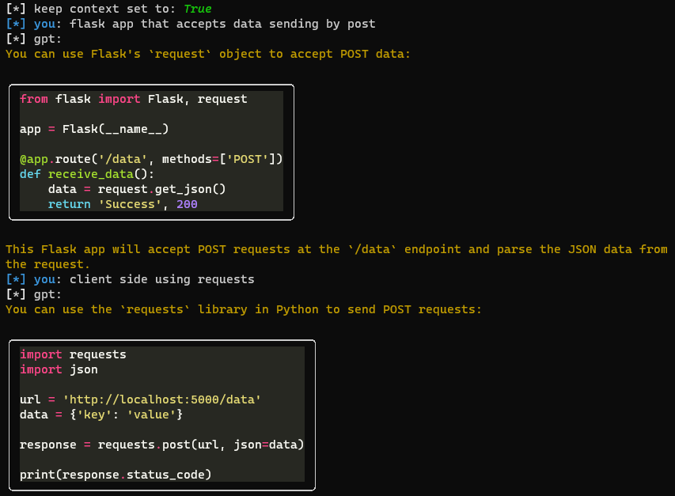

# chat
local gpt chat. To use it create .env file with `OPENAI-API-KEY` field in `chat.py` directory, e.g.:
```
OPENAI-API-KEY=sk-RULLPGZvOOWY8n5mvQ0qxh1o7hjuL1wgpEsjYlpLY8n5mvQb
```

# screenshots

### code generation


### openai models


### context handling

